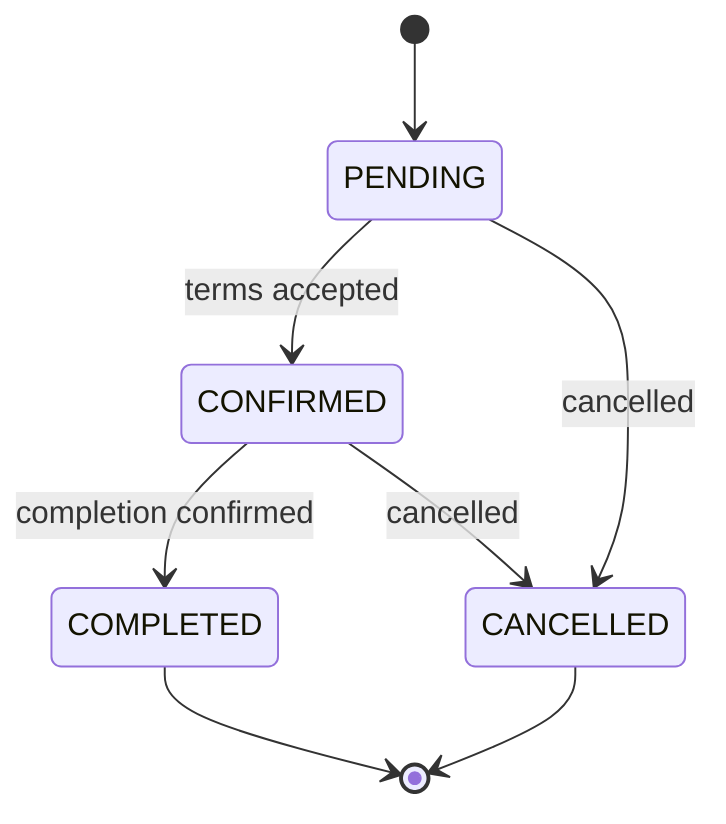

# Errand Transaction Flow MVP

## Goal

errander MVP transaction flow lets travelers post errands, erranders discuss details through chat, both sides confirm the fixed errand terms, and both sides leave reviews after completion.

The MVP keeps the errand lifecycle simple with four states:

- `PENDING`
- `CONFIRMED`
- `COMPLETED`
- `CANCELLED`

Chat remains the place for free-form negotiation, but the final agreed terms must be saved as structured data through a transaction action card.

## Roles

### Traveler

- Creates an errand post.
- Receives chat messages from interested erranders.
- Confirms or rejects proposed errand terms.
- Marks or confirms completion.
- Reviews the errander after completion.

### Errander

- Browses pending errand posts.
- Opens errand detail pages.
- Views the traveler's public profile.
- Starts or continues chat with the traveler.
- Proposes fixed errand terms.
- Marks or confirms completion.
- Reviews the traveler after completion.

## Errand States

### `PENDING`

The errand is open.

Allowed actions:

- Erranders can view detail.
- Erranders can open the traveler's public profile.
- Erranders can start chat.
- Traveler can edit or cancel the errand.
- Either side can discuss terms in chat.
- A transaction action card can be created from chat.

### `CONFIRMED`

Both sides agreed to structured terms.

Allowed actions:

- Both sides can see confirmed price, schedule, place, and assigned errander.
- Both sides can continue chatting.
- Either side can request completion.
- Either side can cancel only if cancellation rules allow it.

### `COMPLETED`

The errand is finished.

Allowed actions:

- Traveler can review errander.
- Errander can review traveler.
- Public profiles show updated review and rating data.
- Errand detail becomes read-only except review entry points.

### `CANCELLED`

The errand is no longer active.

Allowed actions:

- Detail page remains viewable.
- Chat may remain viewable.
- New confirmation, completion, or review is not allowed.

## State Transitions



## Core User Flow

1. Traveler creates an errand.
2. Errander opens the errand from the errand list.
3. Errander checks errand detail and traveler profile.
4. Errander starts chat with the traveler.
5. Both sides discuss details in chat.
6. One side creates a transaction action card with fixed terms.
7. The other side accepts the card.
8. Errand becomes `CONFIRMED`.
9. After the work is done, one side requests completion.
10. The other side confirms completion.
11. Errand becomes `COMPLETED`.
12. Both sides can write one review for each other.

## Transaction Action Card

Negotiation happens in chat, but final agreement must be represented by an action card.

### Card Type

`ERRAND_CONFIRMATION`

### Fields

```ts
interface ErrandConfirmationCard {
  type: 'ERRAND_CONFIRMATION';
  errandId: string;
  proposerId: string;
  receiverId: string;
  priceAmount: number;
  currency: 'KRW';
  scheduledAt: string;
  place: string;
  note?: string;
  status: 'PENDING' | 'ACCEPTED' | 'REJECTED' | 'EXPIRED';
  createdAt: string;
  respondedAt?: string;
}
```

### UI

The chat room should render the card inline between normal messages.

Card content:

- Price
- Schedule
- Place
- Optional note
- Proposed by
- Accept button
- Reject button

Only the receiver can accept or reject.

### Acceptance Result

When accepted:

- Save confirmed terms to the errand.
- Assign the selected errander.
- Change errand status to `CONFIRMED`.
- Disable other pending confirmation cards for the same errand.

## Completion Flow

Completion should also be represented by a structured action, not just a text message.

### MVP Option

Use a simple completion request.

```ts
interface ErrandCompletionRequest {
  requestId: string;
  errandId: string;
  requesterId: string;
  receiverId: string;
  status: 'PENDING' | 'ACCEPTED' | 'REJECTED';
  createdAt: string;
  respondedAt?: string;
}
```

When accepted:

- Change errand status to `COMPLETED`.
- Enable review writing for both participants.

## Review Flow

Reviews are only available after completion.

### Rules

- Only participants can write reviews.
- Review is allowed only when errand status is `COMPLETED`.
- Traveler can review the errander once.
- Errander can review the traveler once.
- Users cannot review themselves.
- Rating is required.
- Review text can be optional or required depending on product decision. MVP recommendation: optional text, required rating.

### Review Model

```ts
interface Review {
  reviewId: string;
  errandId: string;
  reviewerId: string;
  revieweeId: string;
  rating: number;
  content?: string;
  createdAt: string;
}
```

### Rating

- Minimum: `1`
- Maximum: `5`
- Step: `1`

### Profile Aggregates

Public profile should show:

- Average rating
- Review count
- Completed errand count
- Recent reviews

## Public Profile

The app needs a public user profile page.

### Route

```txt
/users/:userId
```

### Entry Points

- Errand detail: traveler profile
- Errander list: errander profile
- Chat room header or participant area
- Review list item

### Profile Content

Required:

- Nickname
- Profile image or initial avatar
- Role
- Active areas
- Completed errand count
- Average rating
- Review count
- Recent reviews

Optional later:

- Bio
- Languages
- Response time
- Verified badges
- Report user

## Errand Detail Page Changes

For `PENDING` errands:

- Show traveler profile entry.
- Show "Chat with traveler" button for erranders.
- Show cancel/edit controls for the traveler.

For `CONFIRMED` errands:

- Show confirmed errander profile.
- Show confirmed price, schedule, and place.
- Show completion request button.

For `COMPLETED` errands:

- Show review buttons if the current user has not reviewed yet.
- Show completed state.

For `CANCELLED` errands:

- Show cancelled state.
- Disable transaction actions.

## API Proposal

### Public Profile

```http
GET /users/:userId
```

Returns:

```ts
interface PublicUserProfile {
  id: string;
  name: string;
  initial: string;
  avatarUrl?: string;
  role: 'traveler' | 'errander';
  areas: string[];
  completedCount: number;
  averageRating: number | null;
  reviewCount: number;
  recentReviews: ReviewSummary[];
}
```

### Start Chat

```http
POST /chat/rooms
```

Body:

```ts
interface CreateChatRoomRequest {
  errandId: string;
  participantId: string;
}
```

### Create Confirmation Card

```http
POST /errands/:errandId/confirmation-cards
```

Body:

```ts
interface CreateConfirmationCardRequest {
  receiverId: string;
  priceAmount: number;
  currency: 'KRW';
  scheduledAt: string;
  place: string;
  note?: string;
}
```

### Respond To Confirmation Card

```http
PATCH /errands/:errandId/confirmation-cards/:cardId
```

Body:

```ts
interface RespondConfirmationCardRequest {
  action: 'ACCEPT' | 'REJECT';
}
```

### Request Completion

```http
POST /errands/:errandId/completion-requests
```

### Respond To Completion

```http
PATCH /errands/:errandId/completion-requests/:requestId
```

Body:

```ts
interface RespondCompletionRequest {
  action: 'ACCEPT' | 'REJECT';
}
```

### Create Review

```http
POST /errands/:errandId/reviews
```

Body:

```ts
interface CreateReviewRequest {
  revieweeId: string;
  rating: number;
  content?: string;
}
```

## Data Model Additions

### Errand

Add:

```ts
interface Errand {
  confirmedErranderId?: string | null;
  confirmedPriceAmount?: number | null;
  confirmedCurrency?: 'KRW' | null;
  confirmedScheduledAt?: string | null;
  confirmedPlace?: string | null;
  completedAt?: string | null;
  cancelledAt?: string | null;
}
```

### Chat Message

Current chat messages are text-only. MVP can add action card support in either of two ways.

Option A:

```ts
interface ChatMessage {
  messageId: string;
  roomId: string;
  senderId: string;
  content: string;
  messageType: 'TEXT' | 'ERRAND_CONFIRMATION' | 'COMPLETION_REQUEST';
  actionCardId?: string;
  createdAt: string;
}
```

Option B:

Keep chat messages text-only and fetch action cards separately per room.

MVP recommendation: Option A. It keeps chat rendering chronological and easier to understand.

## Frontend Implementation Order

1. Public profile page
2. Profile links from errand detail and errander cards
3. Chat start button from errand detail
4. Confirmation action card UI in chat
5. Confirmation card create/respond APIs
6. Confirmed errand state UI
7. Completion request UI
8. Review writing page
9. Review list and rating display on public profile

## MVP Non-Goals

Do not implement these in the first pass:

- Automatic payment capture
- Escrow
- Refund logic
- Dispute center
- Review editing
- Review image upload
- Complex cancellation penalties
- Push notifications

These can be added after the core transaction flow is stable.

## Open Decisions

- Which side can propose the confirmation card?
  - Recommendation: both sides can propose.
- Which side can request completion?
  - Recommendation: both sides can request, the other side must accept.
- Should review text be required?
  - Recommendation: rating required, text optional.
- Can an errand be cancelled after confirmation?
  - Recommendation: allow for MVP, but require a simple cancellation reason later.
- Should profile rating include traveler reviews and errander reviews together?
  - Recommendation: show one average rating per user at first. Split by role later if needed.
